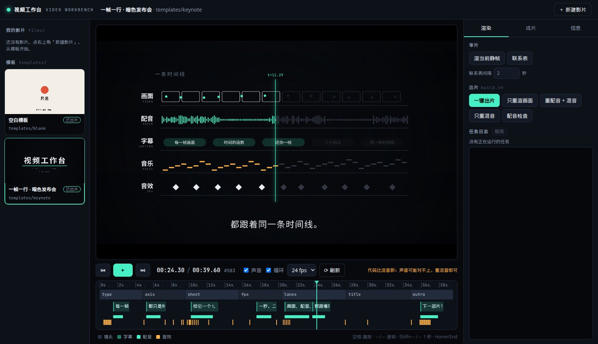
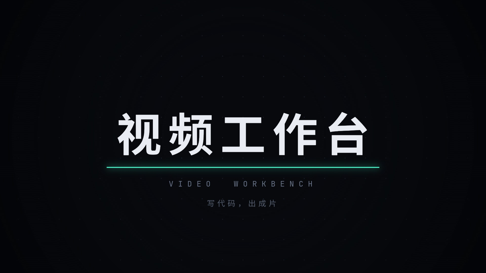

# video-maker · 视频工作台

用代码导演和渲染短片。每部片是一个网页：`render(t)` 画出第 t 秒的画面，无头 Chrome 逐帧截图；配音、配乐、拟音、字幕都跟着同一条时间线，最后 ffmpeg 出片。附一个浏览器里的**工作台**：选片、实时预览、拖时间轴、一键渲染、看日志、播成片。



示例片《一帧一行》（`templates/keynote`，约 40 秒，暗色发布会风格），用这个工作台讲这个工作台：



## 快速开始

需要 Node 20+、Python 3.11+、ffmpeg，以及 Chrome / Chromium（没有的话 `setup.sh` 会下载 headless 版本）。

```sh
sh setup.sh              # 装 Node 包、Python venv、思源黑体、浏览器
npm run studio           # 打开 http://127.0.0.1:4400
```

在工作台里：

1. 左边选「一帧一行」模板，空格播放、拖时间轴、←/→ 逐帧。
2. 点右上角「新建影片」，从模板复制一份到 `films/<片名>/`。简报里线路、视觉风格包、音色、语速、水印、画幅分开选（科普默认 danghb-kepu + 云扬 -5% +「Hobson 小党」；泡芙用定版日常 / 出行墨镜，不默认这套），写入 `films/<片名>/brief.json`。模板只做脚手架。「任务看板」看每部片从选题到复盘卡在哪，进度在 `status.json`，发布状态自己改，工作台不代发。
3. 改画面和台词仍靠 `film.js`、`lines.json`、`audio.py`，或直接跟 Bot 说。保存后预览自动刷新。简报只记意图，不会自动生成成片；要改的话打开这部片的「简报」页保存。
4. 「渲染」页点「一键出片」，看日志；完成后在「成片」页播放、下载 mp4 / srt。
5. 「发布」页有视频号、X、小红书、抖音四份文案，标题 / 正文 / 话题一键复制（见下文「发布文案」）。

命令行也一样：

```sh
sh tools/new-film.sh keynote my-launch      # 新建
sh films/my-launch/build.sh                 # 一键出片 → films/my-launch/out/my-launch.mp4
sh films/my-launch/build.sh events audio mux    # 只重混音
```

## 发布文案

出片的最后一步（`build.sh` 的 `copy` 步骤）或工作台「发布」页的「生成文案」，会为每个平台写一份标题、正文和话题：

```sh
node core/publish/copy.mjs films/my-launch     # → out/copy.json + out/copy-{channels,x,xhs,douyin}.md
sh films/my-launch/build.sh copy               # 同上，走出片流程
```

- **离线、确定性**：只用模板拼装影片自己的素材，不调用在线模型。片名和「一句话」取自 `TREATMENT.md`，台词取自 `lines.json`，风格名和气质取自 `STYLE.md`，幕后信息取自 `CREDITS`，时长取自 `events.json`（没出片时不写时长）。
- **按平台调整**：视频号是 6–16 字短标题 + 清楚的正文和 3 个话题，不放外链、不写引流话术；X 按 280 计数（汉字算 2），中文片自动加一句英文；小红书是 20 字内带钩子的标题、分段 + emoji 的正文和 5–8 个话题；抖音是 30 字内标题 + 短描述。
- **自检**：文案里出现广告法极限词（「最佳」「第一」「必看」等）或超出字数时，`copy.json` 的 `warnings` 和「发布」页会提示。
- **手写覆盖**：在片子目录放 `publish.json`，例如：

```json
{
  "titleEn": "One Frame, One Line",
  "hookEn": "Every frame is just a function of time.",
  "tags": ["视频工作台", "开源"],
  "tagsEn": ["creativecoding"],
  "link": "https://example.com",
  "platforms": { "channels": { "title": "自己写的视频号标题" } }
}
```

`title` / `hook` 覆盖片名和一句话，`tone`（`tech` / `warm` / `plain`）指定语气，`link` 只放进 X，`platforms.<平台>` 可直接改写 `title`、`body`、`tags`。示例见 [`templates/keynote/publish.json`](templates/keynote/publish.json)。

## 素材成片

除了 `render(t)` 的代码片，还可以剪已有视频。片子目录放 `film.json`（`"kind": "footage"`）和 `raw/` 里的 mp4 / mov。本地用 ffmpeg 做镜头检测和抽帧，**看画面、写节拍的是 Bot**（盒子上的模型，仓库里不配第三方 key）。没有 Bot 时，用时长和动静的启发式也能出一条 60–120 秒、横屏 1920×1080 的片子，方便先跑通。

```sh
sh tools/new-film.sh footage-demo my-footage   # 复制示例
# 真素材：清空 films/my-footage/raw/ 后放入自己的视频
sh films/my-footage/build.sh                   # raw 空着会先生成色块小样，再出片
node core/edit/run.mjs films/my-footage ingest shots frames   # 只检测到抽帧，停下来给 Bot
```

Bot 看 `edit/frames/`，把 `edit/beats.json`、需要的话还有 `edit/timeline.json` 和 `lines.json` 的 `source` 写成 `"bot"`，再跑 `voice assemble copy check`。标成 bot / human 的文件不会被下次构建覆盖。竖屏以后改 `film.json` 的宽高即可走同一条缩放，安全区还没做。交接细节见 [docs/footage.md](docs/footage.md)。

工作台里选中素材片，会多一个「素材」页：镜头、抽帧、时间线和组装。代码片的预览、逐帧渲染不受影响。

## 让 Agent 帮你做片

在这个仓库里打开 Cursor / Claude Code 等 Agent，说题目就行，例如：

> 用暗色发布会风格，给我们的开源项目做一支 40 秒的介绍片，中文配音。

Agent 会按 [`AGENTS.md`](AGENTS.md) 的流程工作：问一次问题 → 写分镜本 → 渲风格帧自检 → 配音、配乐、动画、混音 → 出片 → 自检后交付。

## 目录

| 路径 | 内容 |
|---|---|
| `studio/` | 工作台：`server.mjs`（静态服务 + 任务 API + 文件监听）、`index.html` / `app.js` / `studio.css` |
| `core/lib.js` | 页面用的缓动、插值、确定性随机、时间线排布 `layout()` |
| `core/render/` | 静帧、逐帧视频、事件导出、联系表、字幕、合成、成片检查 |
| `core/build.sh` | 一键出片流程（fonts → voice → events → srt → audio → video → mux → poster → check） |
| `core/publish/` | 发布文案 `copy.mjs`：视频号 / X / 小红书 / 抖音 |
| `core/edit/` | 素材片：清点、镜头检测、抽帧、节拍、时间线、旁白、ffmpeg 组装 |
| `templates/footage-demo/` | 素材小样（色块，横屏）。真视频放 `films/<片名>/raw/` |
| `core/tts/` | 中文配音（edge-tts）、干声与成片混音的转写自检 |
| `core/audio/` | 程序化拟音 `sfx.py`、配乐合成器 `synth.py`、混音 `mix.py` |
| `core/fonts/` | JetBrains Mono、按片裁剪思源黑体的 `subset.py` |
| `templates/keynote/` | 暗色发布会风格 + 示例片《一帧一行》（`STYLE.md`、`TREATMENT.md`） |
| `templates/blank/` | 空白骨架，从这里写新风格 |
| `films/` | 你的影片（默认不进 git） |
| `docs/` | [导演手册](docs/directing.md)、[技术手册](docs/technique.md) |

## 页面约定

```js
window.DUR = 39.6;                    // 总时长（秒）
window.render = t => { /* 画第 t 秒，确定性 */ };
window.READY = true;                  // 资源加载完
window.EV = [{ t, type: 'sfx', name: 'whoosh' }, { t, type: 'voice', id: 'l1' }];  // 可选：给混音
window.CUES = [{ t0, t1, text }];     // 可选：字幕
window.SHOTS = [{ id, t0, t1 }];      // 可选：镜头（时间轴、配乐分段）
```

详见[技术手册](docs/technique.md)。

## 致谢

制作方法和部分渲染管线参考、改写自 [lemomo-ai/lemo-opuscar](https://github.com/lemomo-ai/lemo-opuscar)（MIT）。详见 [`NOTICE.md`](NOTICE.md)。

MIT License。
